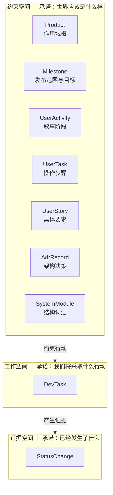

# X-Cartographer 域模型：承诺类型划分

> 状态：**设计定稿（2026-09-15）**。本文档是 X-Cartographer 概念体系的唯一权威定义，**取代** `story-map-redesign.md` §2「命名空间规范」的按名词划分方案。
> 遵循 `docs/design/ai-native-product-principles.md` P1–P5；术语对照见 §7。

## 1. 为什么重新划分：旧方案的三处失效

`story-map-redesign.md` §2 定义了「用户域 / 执行域 / 平台域」三域划分，依据是**实体名词类型**（用户域的加 `user_` 前缀，执行域加 `dev_` 前缀，其余归平台域）。实测证明这条轴失效，表现为三处：

### 1.1 失效一：第三个域是剩余桶，没有统一语言

平台域同时容纳 `Product`（作用域根）、`Milestone`（时间切片）、`StatusChange`（审计账本）、`AdrRecord`（架构决策）——四者彼此无关，既不共享统一语言，也无共同一致性边界。它是「不是前两类的都放这里」的负面定义。

### 1.2 失效二：`SystemModule` 无处安放（已发生的失败，非理论推演）

`technical-constitution.md` §3.6 定义 `SystemModule { id, name, path, responsibility, depends_on }`，并要求它同时被 `architecture_principles.module_ids`、`UserStory.affected_modules`、`DevTask.affected_modules` 引用——**它是唯一横跨 ADR 与 Story/Task 双方的概念**。

但三域都不收它：它不是用户要什么（用户域），不是工作项（执行域），也不是基础设施（平台域）。它**没有表**，数据只能嵌套在 `adr_records.changes` 的 jsonb 里，读取时由 `adr.repository.ts` 的 `foldConstitution` 折叠进内存 Map。

后果实测（2026-09-15 生产库）：

| 症状 | 实测 |
|---|---|
| `user_stories.affected_modules` 填充 | **0/194** |
| `dev_tasks.affected_modules` 填充 | **0/536** |
| dev_task 侧写入路径 | **坏的**——`dev-tasks.ts` 透传 camelCase，`dev-task.repository.ts` 读 snake_case，静默丢弃 |
| §4 `resolveEffectiveArchitectureContext` 算法 | **不存在** |
| Web 模块归属矩阵（`relationship-visualization.md` §4） | **目录未建** |

**这不是"没来得及做"，是"没有归属所以永远排不上"。** 一个概念若在任何域里都不是第一等公民，它的配套功能会系统性缺席。

### 1.3 失效三：Agent 的核心操作被迫穿域墙

系统唯一真正核心的 Agent 操作是 `resolveEffectiveArchitectureContext(task)`（`technical-constitution.md` §4）：以 task 为输入，读 story（意图）、ADR（决策）、module（结构）。而这三样分属三个不同域。

```
task
  ↑ 做到什么算对：story → activity → product      [用户域]
  ↑ 怎么做才合规：module ← adr ← principles       [平台域 + 无处]
  ↓ 做完了吗：status_changes                      [平台域]
```

**域边界本应画在遍历最少处。** 按名词类型切分，恰好把最常一起用的东西分到了不同域。

### 1.4 根因

三域按**名词类型**切分，而非按**一致性边界与用法**切分。这是典型的建模错误：名词分类法必然产生 catch-all 域，且 catch-all 域在下一次扩展时必然再崩。

## 2. 新轴：承诺类型

### 2.1 划分依据

X-Cartographer 是一个 **AI-Native 系统**：人通过 Agent 操作 `xcart` 写入数据，Agent 是主要读写者。因此域划分必须回答 Agent 自省时最需要知道的三件事：

1. **这是什么**（实体语义）
2. **我能怎么动它**（变更方式与权限）
3. **它可信吗**（权威来源）

旧划分回答了第 1 问的一半，完全没回答第 2、3 问。

新轴按**实体承诺了什么**划分：

| 空间 | 承诺 | 变更方式 | 验证方式 | 账本 |
|---|---|---|---|---|
| **约束空间** | 世界应该是什么样 | 低频；变更 = 一次决策 | 满足（achieved）/ 遵守（complied） | 变更入账 |
| **工作空间** | 我们将采取什么行动 | 高频；CAS 抢占 | 完成（done） | 状态流转入账 |
| **证据空间** | 已经发生了什么 | **只追加** | 不可变 | **本身即账本** |

### 2.2 三个空间的实体归类



| 实体 | 表 | 原域 | 新空间 | 变更说明 |
|---|---|---|---|---|
| `Product` | `products` | 平台域 | 约束 | 归一（作用域根） |
| `UserActivity` | `user_activities` | 用户域 | 约束 | 归一 |
| `UserTask` | `user_tasks` | 用户域 | 约束 | 归一 |
| `UserStory` | `user_stories` | 用户域 | 约束 | 归一 |
| `Milestone` | `milestones` | 平台域 | **约束** | ✅ 归位：发布范围 + 目标承诺，属"意图"（见 Q2 决策） |
| `SystemModule` | **`system_modules`** | 无处 | **约束** | ✅ **落表为独立实体**（0006）：结构认知，非 ADR 投影——见 §6.4 |
| `DevTask` | `dev_tasks` | 执行域 | **工作** | 正名（原文「执行域」只含工作项，名不副实） |
| `StatusChange` | `status_changes` | 平台域 | **证据** | 正名（横向切面，本不属任何域） |

> `SystemModule` 是**第八个实体**。它与 `AdrRecord` 同属约束空间，但**独立于 ADR 日志**：
> ADR 记录"何时决定了什么"（决策），模块表记录"系统由哪些部分构成"（结构认知）。
> 单一真相：模块定义只在表，ADR 的 `changes.modules` 机制已移除（§6.4）。

### 2.3 约束空间内部的二分

约束空间内部仍有二分，**不可抹掉**——它决定验证模式：

| 子类 | 实体 | 被验证为 | 例 |
|---|---|---|---|
| **意图（Intent）** | Product / Activity / UserTask / UserStory | **被满足**（achievement） | 「支持跨列拖拽」→ 实现了吗 |
| **规矩（Doctrine）** | AdrRecord / SystemModule | **被遵守**（compliance） | 「网关不得引入 LLM 依赖」→ 遵守了吗 |

两者对 Agent 的用法相同（都是"绑定我行动的权威"，读取动作都是装配上下文），但验证方式不同，故在模型上不做区分、在语义上必须分清。

### 2.4 空间边规则

| 边 | 方向 | 规则 |
|---|---|---|
| 约束 → 工作 | DevTask 锚定 UserStory | **允许**（默认路径：有用户价值的工作项） |
| 约束 → 工作 | DevTask 锚定 SystemModule | **允许**（工程治理路径：见 §2.5） |
| 约束 → 约束 | 任意引用 | 允许，但**不得成环**（见 §5） |
| 工作 → 证据 | StatusChange 记录 DevTask 流转 | 允许，只追加 |
| 工作 → 工作 | DevTask 依赖 DAG | 允许，**必须无环** |
| 工作 → 约束 | **禁止** | 工作项不得改写意图/决策 |
| 证据 → 任意 | **禁止** | 证据只追加，不得被改写 |

### 2.5 工作项的两种锚定（2026-09-18 修订）

**初版规则「DevTask 引用 UserStory 允许且必须」被推翻**——它假设所有工作都有用户价值，
但真实数据存在第二类：**工程治理类工作**（重构、架构一致性、技术债、可测试性）。
这类工作在 x-herald 的 57 个故事中占 10 条（其中 7 todo + 1 cancelled），
在 x-tinker 中占比更高。

**它们不是用户故事**：用户不关心"Service 层一致性"，那是技术负责人的内部诉求。
强行编入故事地图会重蹈「跟踪执行」垃圾桶覆辙（2026-09-18 的骨架诊断结论）。

| 锚定 | 适用 | 载体 | 产品归属 |
|---|---|---|---|
| **UserStory** | 有用户价值的工作项 | 故事地图（Activity → UserTask → Story） | 经 `story → activity → product` 派生 |
| **SystemModule** | 工程治理类工作 | 模块目录（架构治理载体） | 需直连 `dev_tasks.product_id` |

**因此恢复 `dev_tasks.product_id`**（2026-09-15 曾作为死列删除，迁移 0007）。
当时的证据（0/536 填充 + 无真实读点）**仍然成立**——但它只证明了"没有工作项使用直连归属"，
没证明"不需要这种归属"。删列时我写过「池任务如需要重建，story_id 本身可空」，
**漏了产品回溯这条链**：`story_id` 可空是对的，但空了就无法回溯产品。

**`dev_tasks` 的归属字段**（2026-09-18 起）：

| 字段 | 语义 | 约束 |
|---|---|---|
| `story_id` | 锚定用户故事 | 可空（工程治理类为空） |
| `module_id` | 锚定系统模块 | 可空；工程治理类的主锚 |
| `product_id` | 产品归属 | **不挂 story 时必填**（回溯用） |
| `affected_modules` | 涉及模块（信息性） | 保留；与 `module_id` 的区别见下 |

**`module_id` vs `affected_modules`**：前者是**主锚**（这个工作项属于哪个模块，唯一），
后者是**影响面标注**（可能涉及多个模块，信息性）。ADR 的 `module_ids` 是后者语义。

**待办**：功能（Feature）层未实现。终态是 `SystemModule → Feature → DevTask`
（模块下有功能，任务挂功能或直接挂模块）。当前先只做模块层。

## 3. `provenance`：制约来源标记

### 3.1 为什么必需

系统的操作模型是 **人 → Agent → x-cart**：人是权威源，Agent 是操作界面。但 Agent 有两种写 story 的情形：

```
情形 A：人说"用户应该能导出数据"
        → Agent 写入 story   → 这确实是人主张的

情形 B：Agent 读 x-herald 代码，发现有 export 模块
        → Agent 写入 story   → 没人主张过，是 Agent 推断的
```

**两者在 schema 里长得完全一样。** 若混在一起，Agent 后续会把自己推断的东西当成外部事实来做推理——台账的可信度归零。这不是洁癖：**把错误前提喂给推理主体，它还会基于此规划后续步骤。**

### 3.2 定义

约束空间实体新增字段：

```
provenance: 'human_asserted' | 'agent_inferred' | 'imported'
```

| 取值 | 含义 | 例 |
|---|---|---|
| `human_asserted` | 人类直接主张 | 人通过 Agent 说"加这个需求" |
| `agent_inferred` | Agent 从证据推断 | 读代码/issue/文档后归纳 |
| `imported` | 外部系统导入 | 从既有 TOML/Markdown 批量导入 |

**默认值**：`agent_inferred`。理由——**失败安全**：把人类主张误标为推断，代价是多一次确认；把推断误标为人类主张，代价是可信度污染。后者不可逆。

### 3.3 适用范围

约束空间全部六类实体。**工作空间与证据空间不需要**——DevTask 由 Agent 执行，其来源不构成权威问题；StatusChange 的 `changed_by` 已承载操作者信息。

## 4. 约束写入协议

### 4.1 三层写入规则

| provenance | 影响级别 | 落点 | 生效条件 |
|---|---|---|---|
| `human_asserted` | 任意 | 直接写入 | 立即生效 |
| `agent_inferred` / `imported` | **低** | 直接写入 | 立即生效（带标记） |
| `agent_inferred` / `imported` | **高** | 写入 `proposed` | **显式升格**后生效 |

**低影响** = 不改变约束语义：补描述、加标签、调 `order`、填 `affected_modules`。
**高影响** = 改变约束语义：新增/修改/废弃 ADR、增删 SystemModule、创建/删除 UserStory、改 activity 结构。

### 4.2 为什么不用"禁止 Agent 写约束"

曾考虑过两种更严的方案，均被否决：

| 方案 | 否决理由 |
|---|---|
| Agent 只读约束 | 与 AI-Native 定位冲突——把 Agent 当二等公民，系统无法自我演进 |
| Agent 可写但需人事前批准 | 与 P3「声明式约束 + 自证，而非集中裁决」冲突，且成为瓶颈 |

**当前采信的理由**：Agent 的约束写入**不是自授权**——因为来源是人（§3.1）。真正的风险不是"Agent 改约束"，是"Agent 的推断被记成人类断言"。所以解法是 `provenance` + 高影响项落 `proposed`，而非禁止写入。

### 4.3 与既有状态机的复用

`adr_records.status` 已有 `proposed → accepted | rejected`（`technical-constitution.md` §3.1）。高影响约束写入复用同一状态机，**不发明新机制**（P4：新治理机制复用同一本账本）。

### 4.4 不设确认权：状态机即权限模型

**决定（2026-09-15）**：高影响约束的"确认"**不引入权限模型**，而是落为**显式状态升格**。

背景：系统当前**无角色/权限概念**（`apps/server/src/middleware/auth.ts` 只有全局 Bearer token，无 actor 区分）。曾考虑"人确认"方案，但因三点被否决：

| 否决理由 | 说明 |
|---|---|
| 无载体 | 没有 actor 概念，无法表达"谁确认了"——建权限模型是另一个独立工程 |
| 与 P3 冲突 | `ai-native-product-principles.md` P3：「声明式约束 + 自证，而非集中裁决」 |
| 成瓶颈 | 每次高影响写入都要人点确认，Agent 的演进能力被卡死 |

**替代机制**：

| 层次 | 做法 |
|---|---|
| 来源可见 | `provenance` 字段（§3）标出"这条谁主张的" |
| 状态落点 | `agent_inferred` 的高影响写入落 `proposed` |
| 升格动作 | `proposed → accepted` **必须带 `--reason`**；执行者不限（人 / Agent 均可） |

**核心洞察**：`proposed → accepted` 这个转换**本身就是"确认"这个动作的载体**——状态机即权限模型。配合 `status_changes` 账本（P4「每次变更可追溯、有理由」），"约束何时被谁提升为生效"永远可查。

这样既不阻塞 Agent，又不产生自授权闭环：Agent 可以提议，但**提议生效必须留痕且显式**，无法静默自我许可。

| 规则 | 内容 | 理由 |
|---|---|---|
| **无环** | `Milestone ↔ AdrRecord` 类循环引用禁止 | 实测 `milestones.adr_id` 与 `adr_records.milestone_id` 双向引用，前者已被 `adr.repository.ts` 用 `createdAt` 架空 |
| **单权威方向** | 一对概念只允许一个权威引用方向 | 同上；`technical-constitution.md` §5 已定 `adr → milestone` 为权威，反向字段应删 |
| **无悬空** | 引用的实体必须存在 | `affected_modules` 引用不存在的 `SystemModule` 即此类违规 |
| **无死列** | 零读取点 + 零写入点的字段必须删除 | 见 §6 |

**死列是有害的**，不是中性的：对人是噪音，对 Agent 是**关于"系统能做什么"的错误断言**。Agent 自省 schema 会得出"有 `affected_modules` → 我应该标注模块"，然后标注静默消失。

## 6. 已知违规清单（待修）

本节记录 2026-09-15 实测发现的、违反本模型的现存问题。**它们不是本设计的产物，是本设计要消灭的对象。**

### 6.1 冗余跨域边：`dev_tasks.product_id`

| 项 | 实测 |
|---|---|
| 填充率 | **0/536** |
| 唯一读路径 | `findByProductId`，要求 `story_id IS NULL`，而 536/536 全非空 → 恒返回 0 行 |
| 写路径 | 三条中两条零调用方（`saveFullProduct` 全链无客户端引用） |
| 类型层 | `product_id: string` 声明非空，实际列可空，`?? ''` 把 NULL 伪装成空串 |

**初版判定：「死列，应删」——已于 2026-09-15 执行（迁移 0007）。**

**2026-09-18 修正：删错了。** 上述三条证据**仍然成立**，但它们只证明了
「当时没有工作项使用直连归属」，**没有证明「不需要这种归属」**。

被忽略的场景：**工程治理类工作项不锚定用户故事**（§2.5）。这类工作（重构、技术债、
架构一致性）没有对应的用户故事，但**仍需要产品归属**——
而 `story → activity → product` 这条派生链在 `story_id IS NULL` 时**断裂**。

删列时我写过「池任务如需要重建，`story_id` 本身可空」——**漏了产品回溯这条链**。
`story_id` 可空是对的；但空了之后，没有任何字段能回答"这个任务属于哪个产品"。

**教训**：「无死列」准则（§5）要求三维证据，但第四维被漏掉了——
**「这个字段的存在是否为了某个尚未到来的场景」**。前三维（填充率/读点/写点）
只能证明"当前无用"，不能证明"永远无用"。字段承载**结构性归属**（如外键）
时尤其危险：它的价值在首次需要时才体现，而那时它已被删除。

**恢复计划**：迁移 0008 重新加回 `product_id`（并加 `module_id`，见 §2.5）。

### 6.2 意图断裂：108 个 story 无 `activity_id`

| 项 | 实测 |
|---|---|
| `user_stories.activity_id IS NULL` | **108/194** |
| 连带不可见 dev_task | **246/536（46%）** |
| 呈现 | `/api/dev-tasks/all` 返回 290 而非 536；`/next`、产品树、CLI summary 同样丢失 |

因 `dev_tasks.product_id` 全 NULL（§6.1），**无任何兜底路径**——这 246 个任务在任何接口都取不到。

**根因**：迁移脚本对无法按标题语义判定的 story 不猜测归位（设计如此，避免编造归属），但系统未把「未归位」建模为一等状态，导致它表现为「数据消失」而非「待分类」。

### 6.3 状态跨域：`user_stories.status`

`user_stories.status` 与 `dev_tasks.status` 是**两套独立状态机**，物理上互不联动：

| 项 | 实测 |
|---|---|
| 状态账本 | story 170 条、dev_task 548 条（`entity_type` 区分） |
| `story=done` 但子任务未完成 | 144 个 done 故事中存在（如 8/24、10/11） |
| 子任务全 done 但 story 非 done | **10 个** |
| 账本 reason | 46 条「源码审计确认」、9 条「复查：任务全部 done，故事收口」 |

那 46 条正是**人肉同步两套状态的痕迹**。

**判定**：两者都是真域事实，但**词撞了**——
- story done = 「需求**被接受**」（人的裁决，对应意图的**被满足**验证）
- task done = 「工作**被做完**」（工作流事实，对应**完成**验证）

**修法**：story 侧状态更名，使动作主体可辨（如 `accepted`），并消除 UI 同名并列（`tasks-page.tsx` 同屏展示两个「已完成」，语义不同）。

**方案裁定（2026-09-16）**：`SystemModule` **落表为独立实体**（`system_modules`），不做 ADR 投影。

判定依据——它是**结构认知**，不是**决策**：

| | tech_stack / architecture_principles | system_modules |
|---|---|---|
| 性质 | **决策**：每次变更是"某时刻拍了什么板" | **结构认知**：描述"代码库现在有哪些模块" |
| 变化节奏 | 低频、事件驱动 | 随代码演进持续更新 |
| 归属 | ADR 日志（`changes` + 折叠） | 独立表（直接 CRUD） |
| 场景 | 审计"谁在何时决定了什么" | **系统设计**：看全貌、画依赖、做规划 |

**单一真相约定（关键）**：模块的**定义**只存在于 `system_modules` 表。为此 ADR 的 `changes.modules` 机制**已移除**——`foldConstitution()` 不再产出 modules（`adr.repository.ts`），改由 `SystemModuleRepository` 提供。ADR 保留 `module_ids`（标注"这条决策涉及哪些模块"），但不再定义模块。

若两边都可写，即落入 `technical-constitution.md` §3.3 明确拒绝的模式：
> 「检查点的地位必须明确是**日志的确定性缓存、可随时从头折叠重新验证**，不是独立维护、可能与日志脱节的第二份真相」

### 6.4.1 实现要点

| 项 | 落点 |
|---|---|
| 表 | `packages/db/src/db/schema/system-modules.ts`（+ `client.ts` 运行时建表 + 迁移 `0006_system_modules.sql`） |
| 仓库 | `packages/db/src/repositories/system-module.repository.ts`（含 `findMissingIds` 批量存在性校验、幂等 `upsert`） |
| REST | `apps/server/src/routes/system-modules.ts`（GET list/detail、PUT upsert、DELETE） |
| 校验 | `apps/server/src/lib/module-refs.ts` —— story/dev-task 的 `affected_modules` 写入时校验引用存在性 |
| 历史态 | `getConstitutionAsOfMilestone` **不**从表补 modules（该表无版本历史，掺进去会谎称"当时就有这些模块"）——宁可缺失，不撒谎 |

**ID 规范例外**：`system_modules.id` 是人类可读稳定 slug（`gateway` / `web-spa`），**不走** `short-id.ts` 的 `<PREFIX>-<序号>` 规范。理由：它会被 `principles.module_ids` 与 Story/Task 的 `affected_modules` 反复引用，Agent 需要能直接拼出/记住。REST 层用 regex 强制 slug 形态。

### 6.4.2 校验语义（勿扩大）

校验**只做存在性检查，不做业务拦截**——技术宪法 §3.5 定调：「纯粹是信息，不产生任何服务端裁决」。

| 情形 | 行为 |
|---|---|
| 引用存在的模块 | 正常写入，无提示 |
| 引用不存在的模块 | **写入成功** + 响应带 `warnings.unknown_modules`（告警不阻断） |
| 无产品上下文（story 未挂活动） | 跳过校验（无从判断，宁可放过不误报） |
| **删除模块后既有引用** | **不清理**，残留为悬空——同上"不裁决"原则。需定期用 `findMissingIds` 扫描报告，而非自动改写用户数据 |

**`SystemModule` 的归类**：属**约束空间 · 规矩（Doctrine）**实体（§2.2 表），与 `AdrRecord` 同空间——它登记的是"系统由哪些部分构成"这一规范性认知。

### 6.5 死列与死文件

| 对象 | 证据 | 判定 |
|---|---|---|
| `milestones.adr_id` | 0/18 填充；全仓零读取点；设计用途被 `adr.repository.ts` 用 `createdAt` 架空；schema 注释承诺的「仓库层校验归属」不存在；注释指向的 §9 风险条目不存在 | 删 |
| `products.persona` | 0/5 填充；DB 列存在但 shared 类型、repository、route、CLI、UI **五层全无读写路径** | 接线或删，不得留空列 |
| `packages/shared/src/types/*.d.ts`（7 个） | 与同名 `.ts` 并存；`.ts` 优先解析故 `.d.ts` 为死文件；且**已漂移**（`user-story.d.ts` 缺 `user_task_id`） | 删 |

## 7. 术语对照

| 旧术语 | 新术语 | 说明 |
|---|---|---|
| 用户域 | **约束空间·意图** | 内容不变，归属更精确 |
| 执行域 | **工作空间** | 正名：原域只含工作项 |
| 平台域 | **（撤销）** | 实体按承诺类型重新归类 |
| 问题空间 / 解空间 | 约束 / 工作 | 话语义保留，但不再作为域划分依据 |
| `Task` | `DevTask` | 沿用 `story-map-redesign.md` §3.3 |
| `Project` | `Product` | 沿用 `story-map-redesign.md` §3.1 |

## 8. 实施阶段

| 阶段 | 内容 | 前置 | 状态 |
|---|---|---|---|
| **A** | 本文档定稿；`story-map-redesign.md` §2 改为引用本文档 | — | ✅ 完成 |
| **B** | 诚实化 schema：删死列（§6.1/6.5）、删死文件、修 `affected_modules` 写入 bug | A | 部分（死文件已删；死列与写入 bug 待做） |
| **C** | 恢复任务可见性（§6.2）：补归位 + 「未分配」一等状态 | A | ✅ 完成（归位 108/108；「未分配」兜底待做） |
| **D** | 补 `UserTask` 层的**录入能力**（Q3）：CLI `user-task` 命令 + 故事地图内"新建任务列"入口；存量归纳仅作辅助 | A | ✅ 完成（CLI + 地图内入口均已就绪；存量 UserTask 正向补层待做） |
| **E** | `provenance` + 约束写入协议（§3/§4.4） | A | ✅ 完成（六实体列 + 全链透传 + CLI flag + 高影响落 proposed 分类器） |
| **F** | `SystemModule` 落表（§6.4）+ `affected_modules` 强校验 | B, E | ✅ 完成（表+仓库+REST+校验已落地；`changes.modules` 机制移除，ADR bug 修复） |
| **G** | `Milestone` 接入账本（Q2）：补状态流转基线，消除"改了不入账" | A | ✅ 完成 |
| **H** | `story.status` 更名（§6.3）：`done` → 与 DevTask 状态可辨（如 `accepted`） | A | ✅ 完成 |

### 阶段 E 实现说明（2026-09-16）

`provenance` 已覆盖约束空间**全部六实体**（Product/Milestone/UserActivity/UserTask/UserStory/ADR；SystemModule 随 F 落表时同步）：

| 层 | 落点 |
|---|---|
| 迁移 | `0005_provenance.sql`（幂等 `ADD COLUMN IF NOT EXISTS`），并接入 `run-migrate-story-map.ts` 步骤 3 |
| schema | 六实体 `.ts` 各加 `provenance` 列；`client.ts` 运行时建表 SQL 同步 |
| 类型 | `packages/shared` 定义 `Provenance` 联合类型 + `PROVENANCE_VALUES` + `ProvenanceAware` |
| API | 六路由 zod 接受 `provenance`（create + update），仓库层 `dto.provenance ?? 'agent_inferred'` |
| CLI | 六个 `create` 命令透传 `--provenance` |

**默认值落在 schema 层**（`DEFAULT 'agent_inferred'`），失败安全：误标推断只多一次确认；误标人类主张则污染可信度且不可逆。

**高影响分类器（§4.1 第三行，2026-09-16 补齐）**：此前「高影响」只是散文描述，无可判定谓词，
故无法被任何代码执行——高影响项与低影响项一样直接生效，§4.4 的落点规则形同不存在。

| 层 | 落点 |
|---|---|
| 分类器 | `apps/server/src/lib/constraint-impact.ts`：`assessConstraintImpact({entity, action, fields})` → `'low' \| 'high'` |
| 落点判定 | 同模块 `resolveAdrCreateStatus({provenance, status})`——`assessConstraintImpact` 的唯一消费点 |
| 接入 | `routes/adr-records.ts` 的 create：非人主张未指定 status 时**强制 `proposed`** |
| 测试 | `__tests__/constraint-impact.test.ts`（分类边界）+ `api.test.ts` ADR 落点组（端到端） |

判定语义（**白名单式**，方向由 §3.2 失败安全规定——误判为高只多一次显式升格；误判为低会把
Agent 的推断静默记成生效约束且不可逆）：

| 输入 | 判定 |
|---|---|
| 任一约束实体的 `create` / `delete` | high（增删 = 增加/移除一条承诺） |
| `adr` 的 `update` | high（改 ADR 即一次决策变更，与改动哪些字段无关） |
| `update` 触及的字段全部属 §4.1 明列四项（描述 / 标签 / order / affected_modules） | low |
| 其余（含改 `activityId` 换列、字段未给、不在枚举内的字段） | high |

§4.1 原文正列举了高影响项与低影响项，未覆盖全部实体×动作组合（如「改 product 描述」）。
实现取**白名单式**封口：低影响项封闭在原文四项，其余一律高。这是唯一不自相矛盾的选择——
按原文低影响项反推补全「低影响清单」会与「增删/改 ADR 恒高」冲突，且新增字段时默认落低影响，
方向与 §3.2 的失败安全相反。

`entity` 联合**刻意不含 `devTask`**：DevTask 属工作空间，§2.4 明定「工作 → 约束」是禁止边，
故工作项写入不参与本判定（其 `affected_modules` 由 `module-refs.ts` 做存在性校验）。

**不做的事**：不引入权限模型、不设确认权（§4.4）——分类器只回答"落点在哪里"，`proposed → accepted`
这个状态转换本身就是"确认"的载体，执行者不限，唯一要求是带 `--reason`。

### 决策记录（2026-09-15 全部定案）

| # | 问题 | 决定 | 依据 |
|---|---|---|---|
| **Q1** | 高影响约束的确认权归谁 | **不设确认权**——用 `proposed` + `--reason` 显式升格代替（状态机即权限模型） | 系统无权限模型；与 P3「非集中裁决」冲突；见 §4.4 |
| **Q2** | `Milestone` 是域内实体还是投影 | **实体**，归**约束空间**；需接入账本 | 实测 `completed` 但故事未 done 仅 2 处、反向 0 处（对比 story 的双向矛盾 10 处）；`goal` 填充 18/18；有独立语义与 UI 载体 |
| **Q3** | `UserTask` 语义 | **操作步骤**（Patton 第二行脊线），且**必须正向推演补层** | 见下方「Q3 决策说明」 |

#### Q3 决策说明：为何拒绝"现有数据无此需求"的论证

初版分析曾以实测数据（`user_tasks` 0 行、故事标题已是动词短语粒度）论证"中间层无语义空间"，**该论证被否决**，理由是**循环论证**：

> 数据里没有 UserTask，是因为**系统从未支持正向创建**——CLI 无 `user-task` 命令，故事地图无"新建任务列"入口。用"数据没有"论证"不该有"，预设了结论。

**决定**：强制补层（方案 B），且**以正向推演为主**——新项目/新活动录入时，先声明其 UserTask（操作步骤），再在其下放故事。存量 194 个故事的反向归纳只作**辅助起点**，不作为层的定义来源。

**正向推演的录入路径**（链路已就绪，仅缺数据）：

| 环节 | 现状 |
|---|---|
| API | ✅ `POST /api/user-tasks`（`apps/server/src/routes/user-tasks.ts`） |
| 深树 | ✅ `GET /api/products/:id` 返回 `user_activities[].user_tasks[]` |
| 数据层 | ✅ `product.repository.ts` 含 `user_tasks` 与 `user_task_id` 映射 |
| 故事地图 | ✅ 任务列渲染 + 拖拽落列（`patron-canvas.tsx`） |
| 前端页面 | ✅ `/products/:id/user-tasks` |
| **CLI** | ✅ `xcart user-task` list/create/update/delete（`apps/cli/src/index.ts`） |
| **地图内创建入口** | ✅ 活动宽头"新建任务列"（`patron-canvas.tsx` + `user-task-dialog.tsx`）；任务列头悬停可改名/删除 |

**必须遵守的三条规则**（避免重演 `story.status` 漂移病）：

1. **正向为准**：层次的权威来源是"先声明操作步骤，再放故事"，不是从存量故事聚类
2. **允许未归类，不允许长期空洞**：总有权故事落不进任何步骤，正常；但不得长期停留 0 填充
3. **活动不足时补活动**：若某活动下的故事无法归纳出有意义的操作步骤（如"拆解任务"仅 2 个故事），应**补活动**而非硬造步骤

## 9. 与既有文档的关系

| 文档 | 关系 |
|---|---|
| `ai-native-product-principles.md` | **上位原则**。本文档遵循 P1–P5；§3 `provenance` 是 P3 在约束空间的具体化，§4.3 复用 P4 的账本 |
| `story-map-redesign.md` | **被本文档 §2 取代**——该文档的三域划分作废；其 §3（实体定义）、§4（迁移）继续有效 |
| `technical-constitution.md` | **互补**。本文档给出 ADR/SystemModule 的域归属，该文档给出其内部模型与解析算法；其 §4 算法在新轴下不再跨域 |
| `relationship-visualization.md` | **依赖本文档**。其 §4 模块归属矩阵依赖 §6.4 的 `SystemModule` 落表 |
| `x-cartographer-architecture.md` | **互补**。该文档描述"现在长什么样"，本文档定义"概念如何划分" |
